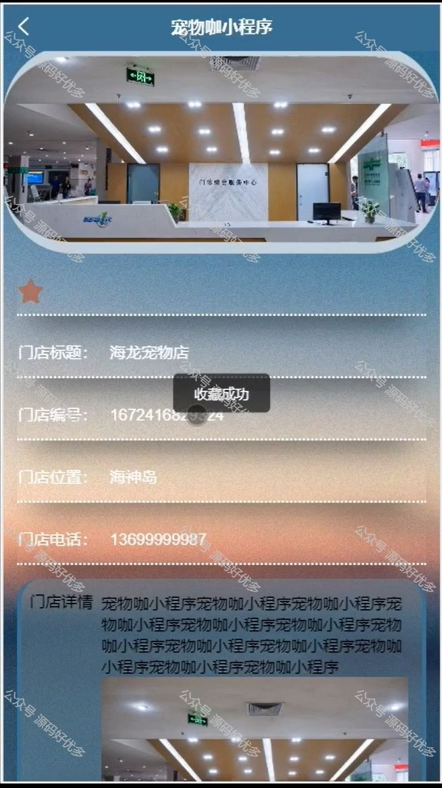
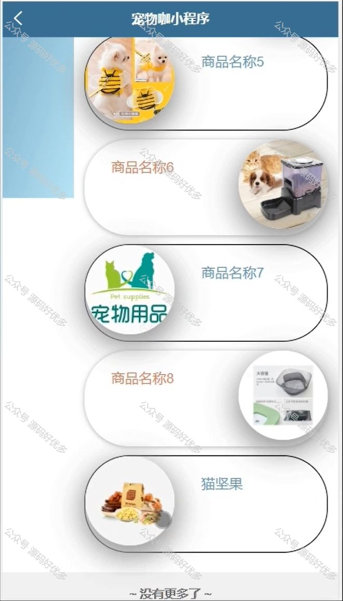

 
## 查看主页获取源码

> **作者介绍**： **✌**全网粉丝10W+本平台特邀作者、博客专家、CSDN新星计划导师、java领域优质创作者,博客之星、掘金/华为云/阿里云/InfoQ等平台优质作者、专注于项目实战 **✌**

  

### 一、作品包含

源码+数据库+全套环境和工具资源+部署教程

### 二、项目技术

前端技术：Html、Css、Js、Vue、Element-ui

数据库：MySQL

后端技术：Java、Spring Boot、MyBatis

  

### 三、运行环境

开发工具：IDEA/eclipse + 微信开发者工具

数据库：MySQL5.7

数据库管理工具：Navicat10以上版本

环境配置软件： JDK1.8+Maven3.6.3

前端Nodejs：14

### 四、项目介绍
项目编号：mpweixinA019

"宠物咖"微信小程序，是一款专为宠物爱好者设计的社交电商平台。它以宠物为核心。小程序旨在为宠物主人提供一站式的养宠体验，让宠物生活更加丰富多彩。

前台用户功能：登录注册、首页、公告咨询、交流论坛、个人中心、会员办理、宠物订单、商品订单、宠物健康、服务预约、宠物寄养、我的收藏管理、我要发贴。

后台分为管理员和员工
管理员的功能：首页、个人中心、用户管理、员工管理、会员类型管理、门店信息管理、会员办理管理、宠物种类管理、商品类型管理、宠物信息管理、宠物订单管理、商品信息管理、商品订单管理、宠物健康管理、服务预约管理、考勤打卡管理、请假信息管理、宠物寄养管理、交流论坛、系统管理
员工的功能：首页、个人中心、会员办理、宠物订单管理、商品订单管理、服务预约管理、考勤打卡管理、请假信息管理、宠物寄养管理

### 五、运行截图

  
